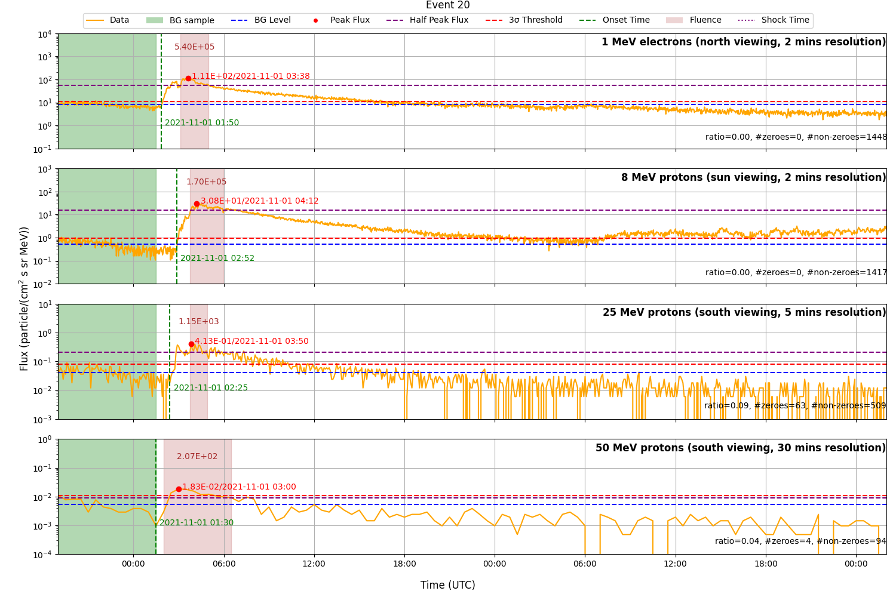

# SPEARHEAD SEP-PACT (Solar Energetic Particle Analysis and Calculation Tool)

## About

SEP-PACT (Solar Energetic Particle Analysis and Calculation Tool) is a software framework designed to automatically analyze Solar Energetic Particle (SEP) events, utilizing data from the High Energy Telescope (HET) onboard Solar Orbiter. It computes key parameters such as the onset time, peak flux, peak time, and fluence for both electron and proton data, enabling consistent and efficient event characterization. Users have the option of combining different HET channels and various time-resolutions. Furthermore, all viewing directions are being used.

## How to install

### Access online (JupyterHub)

You can access the complete VDA tool online on the JupyterHub server of the SPEARHEAD project. All you need is a (free) [GitHub account](https://github.com/signup) for verification. [Access the tool by opening this link!](https://jupyterhub.spearhead-he.eu/hub/user-redirect/git-pull?repo=https%3A%2F%2Fgithub.com%2Fspearhead-he%2Fsep-pact&urlpath=lab%2Ftree%2FVDA%2Fsep-pact.ipynb&branch=main)

### Install locally
To install SEP-PACT locally, follow these steps:
1. This tool requires a recent Python (>=3.10) installation.
2. Clone the repository [https://github.com/spearhead-he/sep-pact](https://github.com/spearhead-he/sep-pact).
3. Open a terminal and navigate to the directory where the code is.
4. Create a new virtual environment and activate it.
5. Install the Python dependencies from the requirements.txt file with `pip install -r requirements.txt`.
6. Open the Jupyter Notebook by running jupyter-lab sep-pact.ipynb

## How to use

Serially run the cells in the sep-pact.ipynb notenboook. Users can adjust variables according to their preferences.

Some cells save intermediate results to files. If these files already exist, users can skip the corresponding cells and load the saved data directly. A markdown cell is present before such cells, indicating whether they can be skipped.

### Example output

Each panel corresponds to a *different energy channel*. The top panel shows *1 MeV electrons*, the second panel shows *8 MeV protons*, the third panel *25 MeV protons*, and the fourth panel *50 MeV protons*. In each panel, the *green-shaded region* indicates the **background flux** used to determine the background level, while the *brown-shaded region* marks the time interval over which the particle flux is integrated to obtain the **event fluence**. The **onset time** is calculated using the *n-sigma method*, and the fluence is derived following the approach described by [Jiggens et al. (2018)](https://doi.org/10.1051/swsc/2018010).

Additionally, each panel includes a **ratio** indicating the *percentage of allowed transitions from valid to zero or NaN values occurring after the onset time, relative to the total number of data points*. This ratio serves as an indicator of data sparsity: when it exceeds 0.1, the results for that channel are considered unreliable and the subplot title is printed red.

Interplanetary (IP) shocks that may be associated with each event are identified using the [ipshocks database](https://ipshocks.helsinki.fi/) (provided as a file (inputs/shocks.dat)) and are imprinted at each panel as a dashed vertical line

## Contributing

Contributions to this tool are very much welcome and encouraged! Contributions can take the form of [issues](https://github.com/spearhead-he/sep-pact/issues) to report bugs and request new features or [pull requests](https://github.com/spearhead-he/sep-pact/pulls) to submit new code.

If you don't have a GitHub account, you can [sign-up for free here](https://github.com/signup), or you can also reach out to us with feedback by sending an email to [jan.gieseler@utu.fi](mailto:jan.gieseler@utu.fi).

## Acknowledgement

 
 

This tool is developed within the [SPEARHEAD (*SPEcification, Analysis & Re-calibration of High Energy pArticle Data*)](https://spearhead-he.eu/) project. SPEARHEAD has received funding from the European Union’s Horizon Europe programme under grant agreement No 101135044.

The tool reflects only the authors’ view and the European Commission is not responsible for any use that may be made of the information it contains.